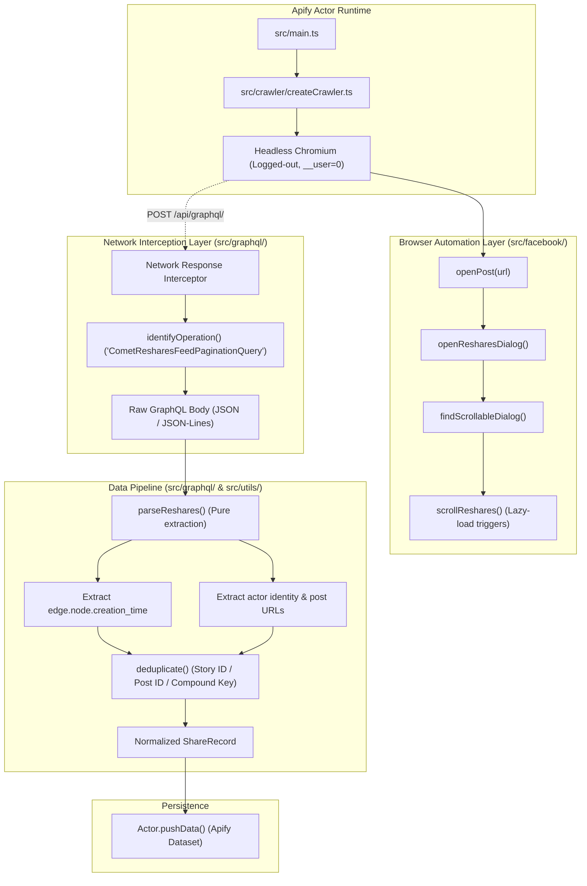

# System Architecture

## Overview

The `facebook-share-time-scraper` Actor operates as an event-driven, passive-network-interception scraper. Instead of reverse-engineering Facebook's dynamic client cryptography and request signing (which frequently break), it leverages a headless Playwright Chromium instance to execute Facebook's official client bundle in an unauthenticated sandbox.

As the browser automates opening and scrolling the "People who shared this" dialog, the network layer captures the resulting GraphQL responses, which are parsed by a standalone schema-normalization engine.

---

## Detailed Component Responsibilities

### 1. Actor Entry & Orchestration (`src/main.ts`, `src/crawler/`)
- Initializes Apify environment and validates input against `ActorInput`.
- Manages Playwright browser lifecycle via Crawlee.
- Enforces logged-out context policies (disabling cookie persistence, clean user-data-dir).
- Handles graceful shutdown and summary reporting.

### 2. Facebook UI Interaction Engine (`src/facebook/`)
- **`selectors.ts`**: Centralized repository of semantic and role-based locators.
- **`openPost.ts`**: Navigates to the Facebook post URL in a clean logged-out context.
- **`dismissLoginModal.ts`**: Detects and dismisses the unauthenticated login modal ("See more on Facebook").
- **`findPostScrollContainer.ts`**: Identifies the post detail dialog or scrollable post feed container.
- **`scrollPostToEngagement.ts`**: Scrolls the post downward until the engagement section is visible.
- **`findReshareTrigger.ts`**: Locates the specific share-count trigger (`X shares` / `X lượt chia sẻ`), avoiding the composer action button.
- **`openResharesDialog.ts`**: Clicks the reshare trigger and waits for the "People who shared this" dialog (`role="dialog"`).
- **`findReshareScrollContainer.ts`**: Locates the inner scrollable container for the reshares feed.
- **`scrollReshares.ts`**: Scrolls the inner reshares container using dynamic element evaluation across React re-renders.

### 3. Network Interceptor & Classifier (`src/graphql/identifyOperation.ts`)
- Hooks into Playwright's `page.on('response', ...)`.
- Filters traffic to `https://www.facebook.com/api/graphql/`.
- Inspects payload headers or friendly name parameter (`CometResharesFeedPaginationQuery`).
- Buffers responses asynchronously to avoid blocking the browser event loop.

### 4. GraphQL Parser & Normalizer (`src/graphql/parseReshares.ts`)
- Decodes JSON and newline-delimited stream responses.
- Traverses `data.node.reshares.edges`.
- Extracts canonical `creation_time` from the outer node.
- Extracts sharer details and URLs with resilient fallbacks.
- Ignores internal attached stories.

### 5. Utilities & Deduplication (`src/utils/`)
- **`timestamp.ts`**: Converts Unix seconds to ISO-8601 UTC and localized string timestamps.
- **`deduplicate.ts`**: Maintains an in-memory Set of seen identifiers, prioritizing `shareStoryId` > `sharePostId` > `shareUrl` > compound key.
- **`logger.ts`**: Structured contextual logger with sensitive credential sanitization.
