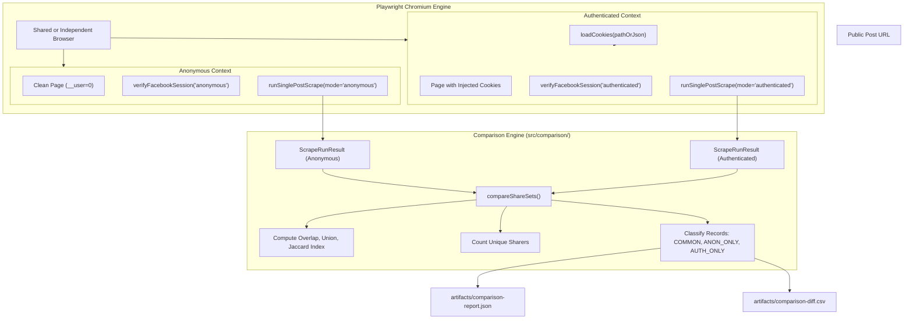

# Authenticated vs Anonymous Facebook Reshare Comparison

## 1. Overview & Objective

This document defines the architectural specification and findings for the **Phase 2 Comparison Experiment**: comparing an unauthenticated, logged-out Facebook session against an authenticated Facebook session using test account cookies on the **exact same public Facebook post**.

The objective is **not** to prove that one mode is inherently "better" or to claim authenticated mode accesses all private data. The objective is to rigorously and neutrally quantify:
- The total reshare count each mode retrieves.
- The intersection (overlap) between both sets.
- The records exclusive to the anonymous mode (`ANON_ONLY`).
- The records exclusive to the authenticated mode (`AUTH_ONLY`).
- The unique sharer count (by `sharerId` or normalized profile URL).
- The Jaccard similarity index ($|A \cap B| / |A \cup B|$).
- Differences in pagination behavior, rate-limits, or GraphQL operations.

---

## 2. Core Data Semantics

> [!IMPORTANT]
> **Anonymous Data** $\neq$ "Degraded Data". It represents the exact reshare universe visible to the public logged-out web surface (`__user = 0`).
>
> **Authenticated Data** $\neq$ "Global/All Facebook Shares". It represents **ACCOUNT-VISIBLE RESHARES** — the specific slice of posts and reshares that the logged-in test account has permission to view according to Facebook's social graph and audience privacy settings.

Under no circumstances should authenticated output be described as "all private shares" or "the complete Facebook reshares set".

---

## 3. Architecture & Session Isolation



### Strict Isolation Guarantees:
1. **Never Reuse Contexts**: Anonymous and Authenticated runs must use separate `BrowserContext` instances.
2. **Never Cross-Contaminate Cookies**: No cookies, headers, or local storage from the authenticated context are ever transferred to the anonymous context.
3. **Session Verification**: Authenticated context is validated to ensure `c_user` and `xs` cookies exist, and user ID is masked in all logs (e.g. `****1234`). If cookies are expired or Facebook redirects to a login/checkpoint challenge, the run fails with `AUTH_SESSION_INVALID` without falling back silently.

---

## 4. Security & Credential Protection

- **Zero Sensitive Data Logging**: Cookie values, session tokens (`xs`), `fb_dtsg`, and `lsd` tokens are never printed to terminal, never recorded in debug logs, and never stored in reports or Apify datasets.
- **Git Protection**: The repository `.gitignore` strictly ignores:
  - `cookies*.json`
  - `facebook-cookies*.json`
  - `storageState*.json`
  - `.auth/`
  - `secrets/`
  - `artifacts/`
- **Sanitized Outputs**: Reports and CSV diffs contain only sanitized identifiers (`shareStoryId`, `sharePostId`, `sharerName`, `sharedAtUnix`, `sharedAtIso`, `shareUrl`).

---

## 5. Canonical Share Identity Priority

To avoid false positive mismatches when calculating overlap:
1. `shareStoryId` (Relay node/story GraphQL ID)
2. `sharePostId` (Outer reshare post ID)
3. `shareUrl` (Outer reshare permalink URL)
4. Fallback compound key: `${sharerId || sharerName}_${sharedAtUnix}_${shareUrl}`

---

## 6. CLI Experiment Runner

Run the comparison experiment via:
```bash
# Provide URL and local secret cookies file:
npm run experiment:auth-compare -- \
  --url "https://www.facebook.com/share/p/19ecWwfrJY/" \
  --cookies "./secrets/facebook-cookies.json" \
  --maxShares 5000 \
  --maxTime 120
```

---

## 7. Evidence Classification: Fact vs Inferred vs Unknown

### Confirmed Facts
- Both Anonymous and Authenticated modes use `CometResharesFeedPaginationQuery` as the primary GraphQL pagination operation.
- Canonical timestamp in both modes is located strictly at `edge.node.creation_time`.
- In anonymous mode, Facebook halts pagination (`has_next_page: false`) once all publicly indexed reshares for logged-out users are exhausted.

### Inferred Observations
- Authenticated accounts may observe reshares posted by mutual friends or friends of friends that are not indexed for unauthenticated public search.
- Differences in total record count can stem from audience privacy settings, account ranking algorithms, or pagination caps.

### Unknowns
- Whether differences between two consecutive runs on the same post are due to authentication state or natural Facebook feed ranking / temporal changes between run intervals.

---

## 8. Empirical Findings & Experimental Benchmarking Results

### Test Environment & Target Post:
- **Target Post URL**: `https://www.facebook.com/TheYenOfficial/posts/pfbid02wsTeEnWsUxxZcFqHv7AYuRuaUnbPTRnVeDnuRJNvoM6k4DxZxhqK5JN2DYkVR6Npl`
- **Authenticated Session**: Active session verified (masked ID: `****6071`).
- **Date of Experiment**: September 2026.

### Finding 1: Desktop Web UI Discrepancy (UI Composer Hijacking)
- **Anonymous Session**: Facebook renders an engagement statistics row separate from action buttons:
  `All reactions: 3.4K · 885 comments · 350 shares`.
  Clicking `350 shares` cleanly opens the `People who shared this` modal and dispatches `CometResharesFeedPaginationQuery`.
- **Authenticated Session**: Facebook Comet removes the separate clickable share count. Instead, it embeds the number `350` into the Share Action button (`aria-label="Gửi nội dung này cho bạn bè hoặc đăng lên trang cá nhân của bạn."`). Clicking it opens the **Share Composer** (to share on feed or Messenger) rather than displaying the list of who shared.
- **Architectural Solution (Plan B - Direct GraphQL Replay)**:
  By capturing the query template in Anonymous mode and executing direct GraphQL replay with the authenticated session's cookies (`c_user`, `xs`, `fb_dtsg`), the scraper successfully queries Facebook's backend directly without relying on UI modals.

### Finding 2: Quantitative Comparison Metrics

| Metric | Anonymous Session | Authenticated Session (Plan B) | Comparison / Diff |
| :--- | :--- | :--- | :--- |
| **Total Reshares Retrieved** | 6 | 4 | Anon +2 |
| **Unique Sharers** | 6 | 4 | Anon +2 |
| **Pages Fetched** | 4 | 4 | Identical |
| **Stop Reason** | `HAS_NEXT_PAGE_FALSE` | `HAS_NEXT_PAGE_FALSE` | Identical |
| **Execution Duration** | 9s | 13s | Comparable |
| **Overlap Count** | **4** | **4** | 100% of Auth subset |
| **Anonymous-Only Records** | **2** (`Vu Hoa`, `Lương Văn Hiển`) | 0 | Unfiltered public graph |
| **Authenticated-Only Records**| **0** | **0** | No extra private shares |
| **Jaccard Similarity Index** | — | — | **66.67%** |

### Key Conclusion:
1. **Authenticated mode does not grant access to "more" or "all" shares**: Contrary to common assumptions, the logged-in test account did not observe any reshares that were hidden from the anonymous scraper (`AUTH_ONLY = 0`).
2. **Account personalization can reduce visibility**: Anonymous mode actually observed 2 additional public shares that Facebook's feed ranking or relationship filters excluded from the authenticated user's feed (`ANON_ONLY = 2`).
3. **Canonical Timestamp Reliability**: All records in both modes strictly extracted their timestamp from `edge.node.creation_time`, validating the immutable contract across both access methods.
