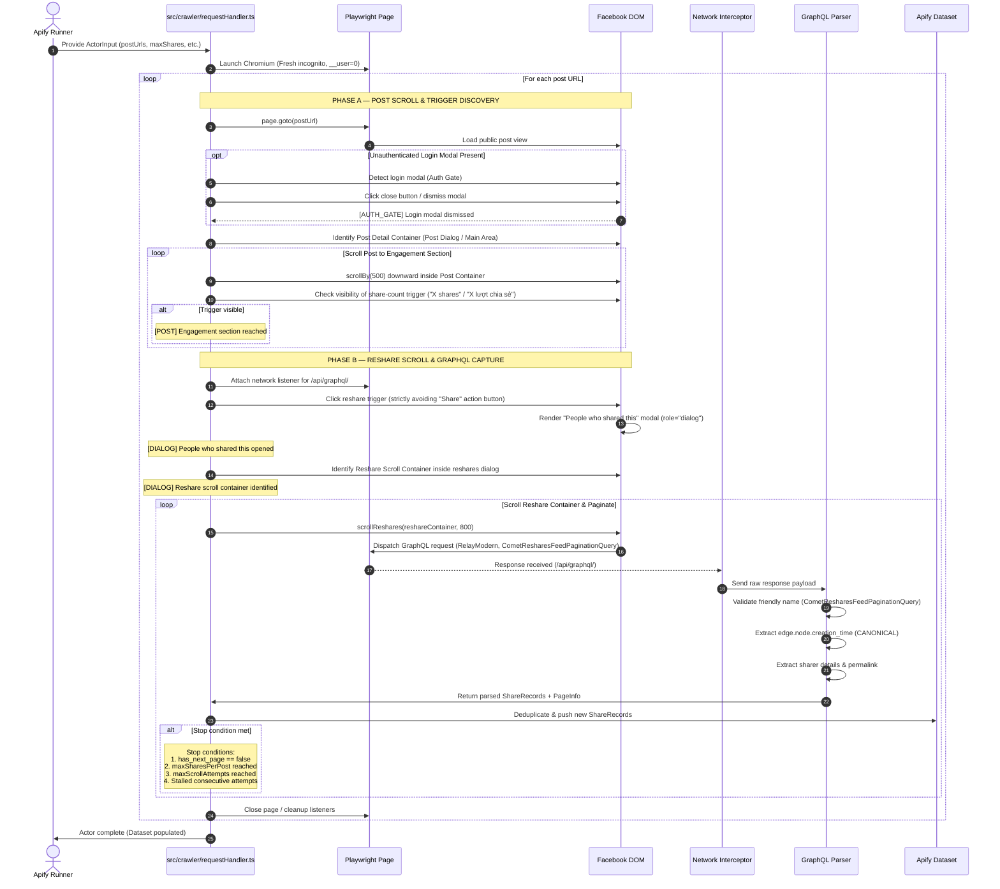
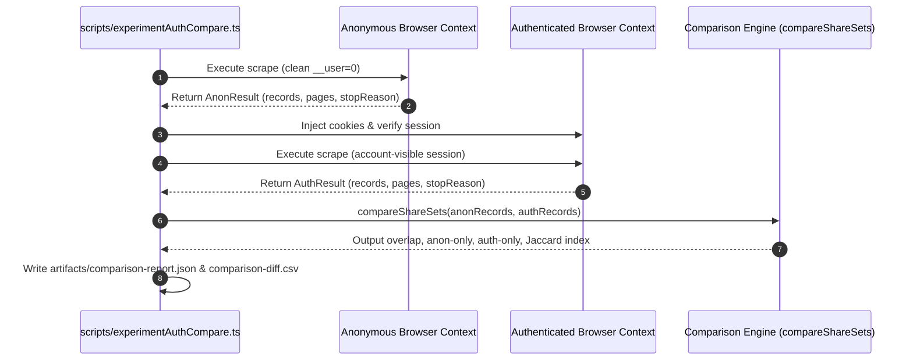

# Scraping Lifecycle & Execution Flow

This document details the exact runtime lifecycle of the `facebook-share-time-scraper`, reflecting the confirmed **Two-Phase Scroll Architecture** in unauthenticated logged-out sessions.

---

## 1. Sequence Diagram



---

## 2. Step-by-Step Breakdown

### Phase A: Post Scroll & Trigger Discovery

1. **Clean Logged-Out Navigation (`openPost`)**:
   - Launches a pristine Chromium context without cookies, local storage, or session tokens (`__user = 0`).
   - Navigates to target public post URL.

2. **Login Modal Dismissal (`dismissLoginModal`)**:
   - Facebook routinely presents an unauthenticated login modal ("See more on Facebook", "Log In", "Đăng nhập") covering the post.
   - **Crucial Rule**: This modal is **EXPECTED behavior** and is NOT treated as `FACEBOOK_BLOCKED`.
   - The crawler detects this modal and dismisses it via its close button (`[aria-label="Close"]`, `[aria-label="Đóng"]`).
   - Logs:
     ```text
     [AUTH_GATE] Login modal detected
     [AUTH_GATE] Login modal dismissed
     ```

3. **Identify Post Container (`findPostScrollContainer`)**:
   - After modal dismissal, Facebook displays the post inside a post-detail dialog (`div[role="dialog"]:has(div[role="article"])`) or main feed container.
   - Measures and logs:
     ```text
     [POST] Post dialog detected
     [POST] Post scroll container:
            clientHeight=...
            scrollHeight=...
     ```

4. **Scroll Post to Engagement (`scrollPostToEngagement`)**:
   - Engagement counters (likes, comments, share counter) reside at the bottom of the post content and are not initially visible in the viewport.
   - Progressively scrolls the **POST CONTAINER** downward until the share-count element (`350 shares`, `350 lượt chia sẻ`) is detected.
   - Strictly avoids the naked `Share` / `Chia sẻ` action button (which triggers the composer).
   - Logs:
     ```text
     [POST] Engagement section reached
     [DIALOG] Reshare trigger detected: "350 shares"
     ```

---

### Phase B: Reshare Scroll & GraphQL Capture

5. **Open Reshares Dialog (`openResharesDialog`)**:
   - Clicks the verified share-count element.
   - Waits for the second modal dialog: **"People who shared this"** (`role="dialog"`).
   - Logs:
     ```text
     [DIALOG] People who shared this opened
     ```

6. **Identify Reshare Scroll Container (`findReshareScrollContainer`)**:
   - Locates the inner scrollable container (`scrollHeight > clientHeight`, `overflow-y: auto/scroll`) specifically inside the reshares dialog.
   - This container is **completely distinct** from the post container in Phase A.
   - Logs:
     ```text
     [DIALOG] Reshare scroll container:
            clientHeight=...
            scrollHeight=...
     ```

7. **Network Listener Activation & Synchronization (`ReshareNetworkInterceptor`)**:
   - Listens to all POST requests to `https://www.facebook.com/api/graphql/`.
   - Detects `fb_api_req_friendly_name = CometResharesFeedPaginationQuery`.
   - Bounded async barrier synchronizes scrolling with response delivery to eliminate flaky timeouts.

8. **Reshare Feed Lazy Loading (`scrollReshares`)**:
   - Smoothly scrolls the reshare container downward to trigger Relay GraphQL pagination queries.
   - Logs:
     ```text
     [GRAPHQL] CometResharesFeedPaginationQuery detected
     [GRAPHQL] Parsed 1 response chunk
     [PAGE] Edges: 1 | New records: 1
     [SHARE] { ... }
     ```

9. **Multi-Signal Termination**:
   The crawler terminates pagination for a post when any of the following occur:
   - `has_next_page === false`: Facebook reached the end of public reshares.
   - `totalCollected >= maxSharesPerPost`: Configured limit met.
   - `scrollAttempts >= maxScrollAttempts`: Safety threshold reached.
   - `consecutiveEmptyAttempts >= 10`: Pagination stalled.

---

## 3. Phase 1.5 Hybrid Direct Pagination Flow

In Phase 1.5, a faster, more resilient pagination architecture was experimentally proven:

```
[Browser Bootstrap]
  ├─ 1. Open post in logged-out Chromium
  ├─ 2. Dismiss login modal
  ├─ 3. Scroll post to engagement & click reshare trigger
  └─ 4. Perform EXACTLY ONE scroll in reshares dialog
           │
           ▼
[Template Capture]
  ├─ Capture browser's real POST /api/graphql/ request
  ├─ Extract template form data (doc_id, lsd, variables)
  └─ Extract initial end_cursor from first response
           │
           ▼
[Direct Replay Loop (Zero Further UI Scrolls)]
  ┌───────► Check page_info.has_next_page
  │         ├─ If false -> Terminate cleanly
  │         └─ If true  -> Proceed to replay
  │               │
  │               ▼
  │         page.evaluate(window.fetch)
  │         - Endpoint: /api/graphql/
  │         - Body: cloned template with variables.cursor = nextCursor
  │         - Credentials: 'include' (same anonymous context)
  │               │
  │               ▼
  │         Parse response via parseReshares()
  │         - Deduplicate new ShareRecords
  │         - Update end_cursor
  └───────────────┘
```

### Key Advantages of Hybrid Direct Replay
1. **Dramatic Speed Improvement**: Eliminates UI scroll throttling, smooth scroll animations, and DOM rendering overhead.
2. **Resilience to React Re-rendering**: Replay operates via network fetch in the page context, completely immune to DOM nodes detaching or re-mounting.
3. **Canonical Timestamp Invariant Preserved**: Extracts canonical `edge.node.creation_time` directly from the raw GraphQL stream.

---

## 4. Anonymous vs Authenticated Comparison Flow



