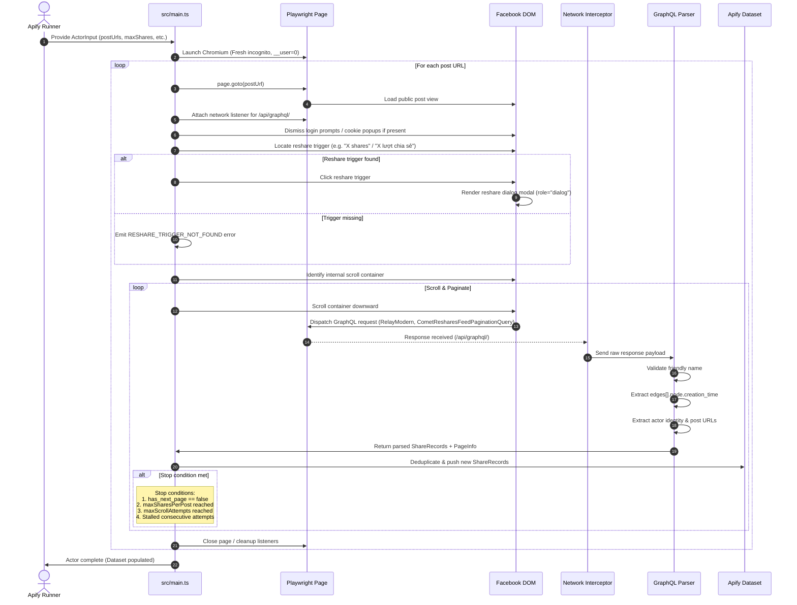

# Scraping Lifecycle & Execution Flow

This document details the exact runtime lifecycle of the `facebook-share-time-scraper`.

---

## 1. Sequence Diagram



---

## 2. Step-by-Step Breakdown

### Step 1: Context Initialization
- Launch unauthenticated Chromium context.
- Ensure no persistent cookies, local storage, or cached credentials exist.

### Step 2: Post Navigation & Wall Handling
- Navigate directly to the Facebook post URL.
- Wait for the post container to mount.
- If Facebook presents a full-screen login barrier or modal dialog, attempt to close or bypass it using non-destructive selectors.

### Step 3: Triggering Reshares Modal
- Inspect the post footer for the share count element.
- Click the element to open the "People who shared this" dialog (`role="dialog"`).
- Wait for the dialog container to render.

### Step 4: Network Interception Activation
- Playwright's `page.on('response')` catches all POST requests to `https://www.facebook.com/api/graphql/`.
- Inspect the request body to verify:
  ```text
  fb_api_req_friendly_name = CometResharesFeedPaginationQuery
  ```

### Step 5: Lazy Loading via Scoped Scrolling
- Retrieve the bounding element of the reshares scroll list inside the dialog.
- Perform gradual scroll actions (`element.scrollTop += delta`).
- Introduce a configurable throttle (`scrollDelayMs`) to allow Facebook frontend to dispatch subsequent queries.

### Step 6: Response Parsing & Canonical Extraction
- Intercepted GraphQL chunks are decoded.
- Each edge's `edge.node.creation_time` is extracted as the canonical share timestamp.
- Any nested `attached_story.creation_time` is strictly ignored.
- The actor's profile details and permalink are parsed.

### Step 7: Deduplication & Pushing Data
- Compute the deduplication key.
- Discard already seen keys.
- Call `Actor.pushData(record)` for all new unique records.

### Step 8: Multi-Signal Termination
The crawler terminates pagination for a post when any of the following occur:
1. **`has_next_page === false`**: Facebook indicates no further public reshares exist.
2. **`totalCollected >= maxSharesPerPost`**: User-configured quota met.
3. **`scrollAttempts >= maxScrollAttempts`**: Hard limit reached to prevent infinite scrolling.
4. **`consecutiveEmptyAttempts >= threshold`**: Scroll actions no longer trigger queries or yield new items (stalled pagination).
